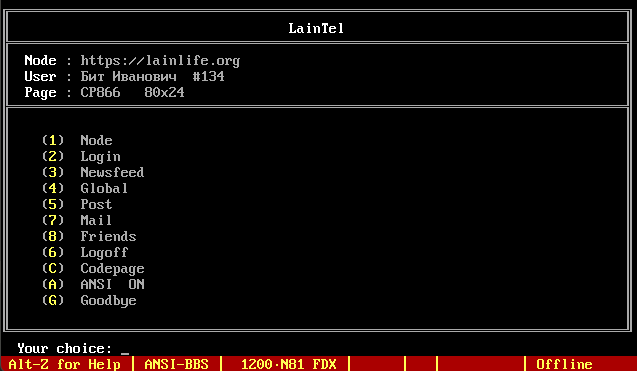
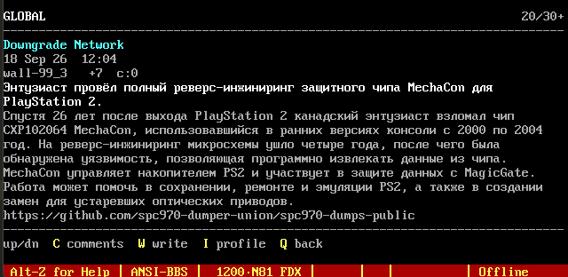

## LainTelnet

<p align="left">
  
  
</p>

Telnet-клиент для социальной сети [LainLife](https://lainlife.org). Выше показаны скриншоты работы клиента в терминале **Telix** 1989 года, запущенном под управлением операционной системы MS-DOS.

## Функционал

На данный момент поддерживаются:

* Вход в аккаунт социальной сети
* Чтение ленты - как своей, так и глобальной
* Просмотр профилей, информации о пользователях и их стен
* Система друзей - просмотр текущего списка друзей, отправка и принятие заявок
* Система личных сообщений - просмотр списка сообщений, отправка сообщений в существующие чаты и создание новых чатов
* Создание постов на своей и чужой стене

Кроме того, клиент поддерживает работу с кириллицей и форматирование постов по стандарту LainLife.

## Установка

Скачайте репозиторий и запустите сервер командой:

```bash
python3 main.py
```

Поддерживаются следующие аргументы:

```text
  --host HOST          - хост, на котором будет работать сервер
  --port PORT          - порт, на котором будет работать сервер
  --instance INSTANCE  - выбор инстанса по умолчанию
  --encoding ENCODING  - отключение проверки кодировки клиента.
                         Весь сервер будет работать в одной кодировке:
                         utf-8 / cp866 / cp1251
  --stdio              - запуск Telnet-клиента без сервера
```
